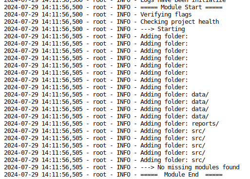

## Door-and-Glass-Audio-Classification
The project is tasks to create a model that can identify the class of a given audio particularly, classes
based on the title of the project. The process in summary begins with a 30 second audio wav format (modifyable) 
that would be seperated then sampled as a 3 seconds clip from the wave file. There are multiple methods and 
techniques that have been serialized to help extract features from the audio file. All of these methods boils
down into a general convertion and that is the spectogram. The techniques allows us to reintroduce the problem
to solving it to a more well established field of machine learning. There are several models that we can used to
conduct computer vision on the spectogram but in this project, we will limit the scope that would be listed in
the section below.
### Project Structure
An in-depth discussion on important folders and files. 
```
    api
        ---> res # The sounds that was received from the client
        ---> server_api.py # Handles communication to clients and the models
        ---> model_api.py # The interface for loading a model
        ---> utils.py # Useful functions to share
    configs
        ---> config.yaml # This is a descriptive overview of important folders
        ---> log_config.yaml # Configurations that modules can use to configure the logging in one go
        ---> network_config.yaml # Networking configuration such setting the IP, Address, Model to be used and Etc
        ---> preprocess_config.yaml # Obviously ...
        ---> model_config.yaml # Certain saving paths and patterns that simplyfies the configuration
        ---> dataset_config.yaml # Determines what datasets are already existing else the drive would fetch it using the url
    data
        ---> raw # Folder path for the compiled dataset
        ---> process # Ready to be used by all models
        ---> interim # Processed by exposed to change 
        ---> external # Outside source
    logs
        ---> info.log # Some logs don't show themeselves in the terminal/CMD
    notebooks # All of the notebooks that is used (there purpose is defined for every notebook at the starting cell)
    reports
        ---> figure # Saving image base outputs
    src
        ---> model # Classes for each model used
        ---> preprocessing # All of the tools and process for prepareation
        ---> scraping
                ---> drive.py # Reads the dataset_config and downloads missing datasets
        ---> utilities # Common universal tools
        ---> weights # Path for all saved model
    tests
        ---> client_test.py # Testing the server_api for results
```
### Step by Step Usage
To start using the project, we need to first have the root directory to an empty folder using git.
```
    git pull origin yamnetV0.1.0
```
Once received, the project will contain a requirements.txt that you need to run (either from the virtual environment or the global system) this code `pip3 install -r requiremnets.txt`. The `app.py` is the entry point of the project source files. There are a few flags defined in the file that you can use through system arguments. I will layout these commands\flags with their respective syntax.
```
    python3 app.py -[flag] [**args]
    Flags:
        ---> -ch: to check the health of the projects if any important component is missing
        ---> -s: run a module that will extend to **args and the following are the choices
                * drive.py
                * model.py
                * audio.py
                * server_api.py
        ---> -h: display help commands
```
Let's try checking the health of the project, type this following command (make sure your in the same directory as the app.py file) `python3 app.py -ch`. The end result should look like this...

Now we finally proceed to the server api of the project. The network_config.yaml found in the configs folders has all the information need to connect to the server. The host address and the port can be modify by the project owner and such, feel free to modify the configuration settings. To run the module, simply type `python3 app.py -s server_api.py`.

> [!CAUTION]
> The duration of the audio is fixed to 5 seconds. The segmentation process is yet to be integrated with the that use of a window function before the input to the model.
> [!NOTE]
> This tutorial is only akin to the server api side of the project not the development portion.

### Models Used and There Current Evaluation
- YAMNet with an additional dense layer to match the classes
### External Datasets Citing
```
@inproceedings{piczak2015dataset,
  title = {{ESC}: {Dataset} for {Environmental Sound Classification}},
  author = {Piczak, Karol J.},
  booktitle = {Proceedings of the 23rd {Annual ACM Conference} on {Multimedia}},
  date = {2015-10-13},
  url = {http://dl.acm.org/citation.cfm?doid=2733373.2806390},
  doi = {10.1145/2733373.2806390},
  location = {{Brisbane, Australia}},
  isbn = {978-1-4503-3459-4},
  publisher = {{ACM Press}},
  pages = {1015--1018}
}
```